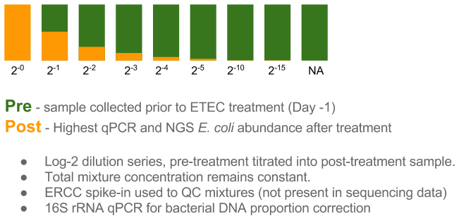
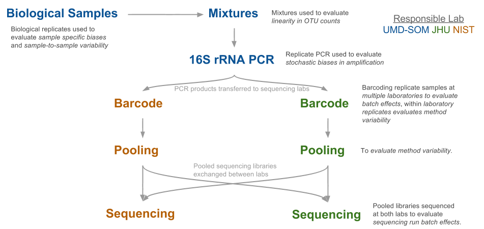

# Methods
## Experimental Design

## Two-Sample-Titration Design  
Samples from a vaccine study were selected for use in the study.  See the sample selection vignette for sample description and details. 
For the two-sample titration post-treatment samples (stool samples collected _after_ exposure to _E. coli_ ETEC) were titrated into pre-treatment samples (stool samples collected _before_ exposure to _E. coli_ ETEC) with $log_2$ changes in pre to post sample proportions \@ref(fig:tst_diagram). 

```{r tst_diagram, echo=FALSE, fig.width = 4, fig.cap="Schematic of two sample titration process with the $log_2$ titrations used in the study."}

```

### Generating mixtures

DNA concentrations and dilution volumes  

```{r}
biosample_info  %>% knitr::kable()
## calculate dilution concentrations
```

Volumes used to generate mixtures  

```{r}
tst_prep  %>% knitr::kable()
```

ERCCs were spiked into mixtures for use in QC.  
* ERCC plasmid prep  
* Calulate from `tst_prep`  
* ERCC qPCR assay information  

## Sample Selection  

## Sample Processing Workflow
__NOTE__ Need to update for single sequencing lab.  
An interlaboratory experimental design with technical replicates was used to enable characterization of sources of bias and variability in of individual stages of the sample processing procedure \@ref(fig:sample_workflow). 
To eliminate confounding variability at different steps in the protocol; amplicon PCR, barcoded amplicons, and pooled libraries are processed at both laboratories (e.g. before barcoding and sequencing).   

```{r sample_workflow, echo=FALSE, fig.width = 4, fig.cap="Flow chart of the sample processing interlaboratory design annotated with the sources of bias and variability at each step of the sample processing procedure."}

```  

__TODO__ Marc's bubble diagram to show replication steps  

* PCR layout  
 
```{r fig.width = 6, fig.cap="PCR plate layout experimental design."}
sample_sheet %>%
    filter(kit_version == 'A') %>% 
    separate(pos, c("row","col"), sep = "_") %>% 
    mutate(col = as.numeric(col)) %>%
 ggplot(aes(x=col, y=row)) +
    # geom_point(data=expand.grid(seq(1,12), seq(1,8)), aes(x=Var1, y=Var2),
    #            color='grey90', fill='white', shape=21, size=6) +
    geom_point(aes(color = sampleID), size=10) +
    geom_text(aes(label = dilution)) +
    coord_fixed(ratio=(13/12)/(9/8), xlim=c(0.5,12.5), ylim=c(0.5,8.5)) +
    # scale_y_reverse(breaks=seq(1,8), labels=LETTERS[1:8]) +
    scale_x_continuous(breaks=seq(1,12)) +
    labs(title="PCR Layout") +
    theme_bw()
```