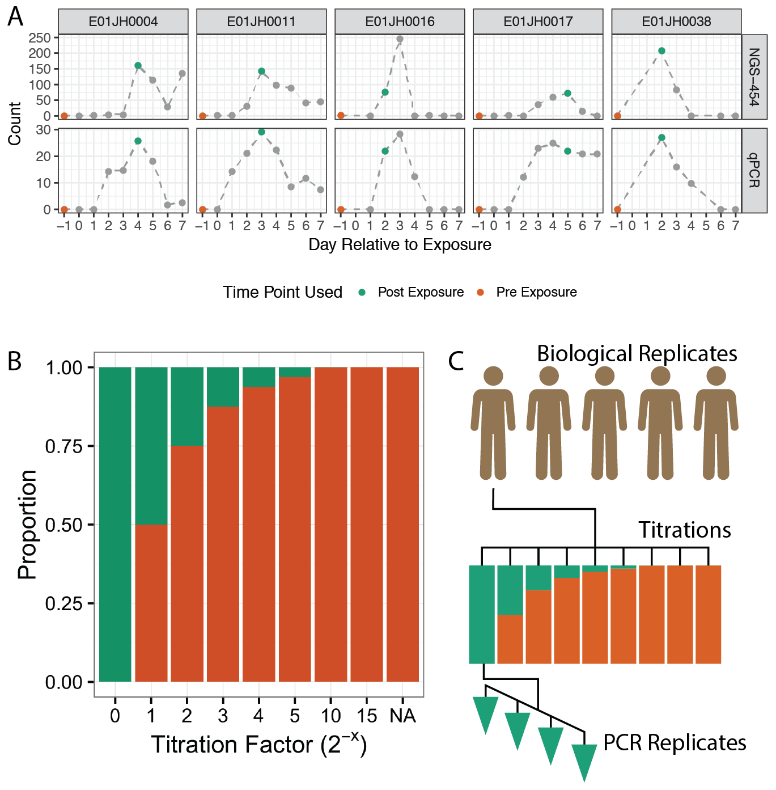

# Methods
Dataset of environmental sample mixtures was generated and used to evalute the abundance values and log-fold change values for count tables generated using three different bioinformatic pipelines. 

## Two-Sample Titration Design  
Samples from a vaccine trial were selected for use in the study [@harro2011refinement].
Five trial participants were selected based as those with no _Eshechichia coli_ detected in stool samples before exposure to Enterotoxigenic _Escherichia coli_ (ETEC)) and timepoints with the highest concentration of _E. coli_ after exposure [@pop2016individual] \@ref(fig:experimenta_design) (Panel A).
For the two-sample titration post-treatment samples (stool samples collected after exposure to _E. coli_ ETEC) were titrated into pre-treatment samples (stool samples collected _before_ exposure to _E. coli_ ETEC) with $log_2$ changes in pre to post sample proportions \@ref(fig:experimenta_design) (Panel B).

Unmixed samples were diluted to 12.5 $ng/\mu L$ in tris-EDTA buffer prior to making two-sample titrations.
Initial DNA concentration was measured using NanoDrop ND-1000 (Thermo Fisher Scientific Inc. Waltham, MA USA).

```{r experimental_design, echo=FALSE, fig.width = 4, fig.cap="Sample selection and experimental design for two-sample titration 16S rRNA metagenomic sequencing assessment dataset. A) Pre- and post-treatment samples from five participants in a vaccine trial (Harro et al. 2011) were selected based on Escherichia coli abundance measured using qPCR and 454 16S rRNA metagenomics sequencing (454-NGS), data from Pop et al. 2016. Pre- and post-treatment samples are indicated with orange and green data points. Grey indicates other samples from the vaccine trial time series. B) The pre-treatment samples were titrated into post-treatment samples following a $log_2$ dilution series. The NA titration factor represents the unmixed pre-treatment sample. C) The five vaccine trial participants are biological replicates and independent sets of two-sample titrations were mixed for each. The result was a total of 45 samples, 7 titrations + 2 unmixed samples times 5 biological replicates. Four replicate PCRs were performed for each of the 45 samples resulting in 190 PCRs."}

```

### Titration Validation
__TODO__ Supplemental Table with ERCC plasmids, qPCR assay, and experimental design.  
Table design
1. Sample, Treatment, ERCC plasmid, qPCR assay, cat number
2. sample, PCR plate, well position, qPCR assay, CT value
3. plate, well position, absorbance


To ensure that the two-sample titrations were correctly mixed independent ERCC plasmids were spiked into the unmixed pre and post treatment samples (Supplemental Table ERCC).
The ERCC plasmids were resuspendended in 100 $ng/\mu L$ tris-EDTA buffer and 2 $ng/\mu L$ was spiked into each sample.  
__TODO__ Check if the ERCC were first diluted then 2 ul were spiked into the unmixed samples  

Plasmid abundance was quantified using TaqMan gene expression assays (FAM-MGB) (Catalog # 4448892, ThermoFisher) specific to each ERCC plasmids using the TaqMan Universal MasterMix II (Catalog # 4440040, ThermoFisher Waltham, MA USA).

To account for differences in the proportion of bacterial DNA in the pre and post-treatment samples, the amount of bacterial DNA was quantified using the Femto Bacterial DNA quantification kit (Zymo Research, Irvine CA).
All two-sample titrations and unmixed samples were run in triplicate along with a standard curve.
An in-house standard curve consisting of log10 dilutions of _E. coli_ DNA was used as the standard curve. ( __TODO__ Supplemental Material justification for using in-house instead of manufacturer provided standard curve).

All qPCR assays were performed using the QuantStudio Real-Time qPCR (ThermoFisher).
The amplification data and Ct values were exported from the QuantStudio™ Design and Analysis Software v1.4.1 as tsv files for statistical analysis.

## Sample Processing Workflow
The resulting in 45 samples (seven titrations and two unmixed samples for the five biological replicates) were processed using a standard 16S rRNA amplicon sequencing workflow based on the Illumina 16S library protocol (REF).
The protocol consisted of an initial 16S rRNA PCR followed by a separate sample indexing PCR.
A total of 192 PCRs were run including four PCR replicates per sample and 12 no template controls (__TODO__ Supplemental PCR plate figure).
After the initial PCR and clean-up the 192 PCRs were split into technical replicates and sent to two laboratories for library preparation and sequencing.
The concentration of the resulting indexed 16S PCR products were normalized using the SequalPrep Normalization Plate Kit(Catalog n. A10510-01, Invitrogen Corp., Carlsbad, CA).
The normalized indexed samples were pooled and sequenced on the Illumina MiSeq (Illumina Inc., San Diego, CA).  
