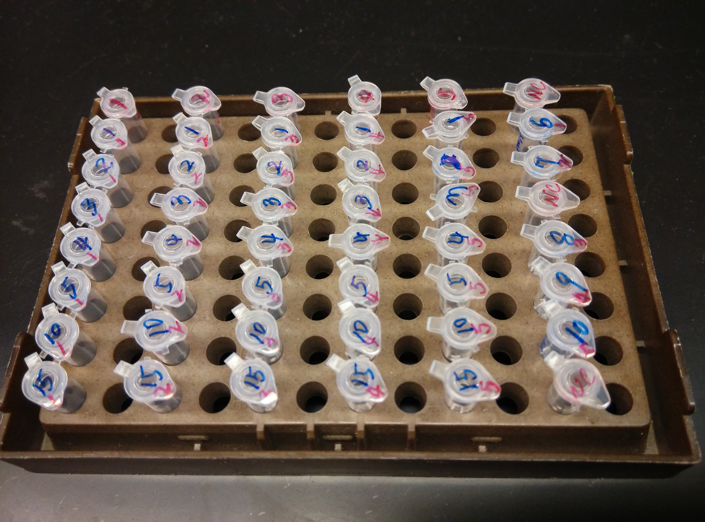

## Sequencing 
The 16S PCR targeted the V34 region, Bakt_341F and Bakt_806R [@klindworth2012evaluation]. The V34 target region is `r 805-341` bp, with forward and reverse reads overlaping by `r 600 - (805-341)` bp \@ref(fig:rra_diag) [@yang2016sensitivity] ( http://probebase.csb.univie.ac.at). The primer sequences included additional overhang adapter seuqences to facilitate library preparation (5'- TCGTCGGCAGCGTCAGATGTGTATAAGAGACAGCCTACGGGNGGCWGCAG - 3') and reverse primers (GTCTCGTGGGCTCGGAGATGTGTATAAGAGACAGGACTACHVGGGTATCTAATCC). 

The reaction was performed according to the Illumina protocol using the KAPA HiFI HotStart ReadyMix reagents (KAPA Biosystems, Inc. Wilmington, MA). 
The resulting PCR product was then verified using gel electrophoresis. 
Next the PCR product was purified and concentration was assessed using pico green ( __Reagent Info, plate reader info__). 
After purification the 192 samples were indexed using the Illumina Nextera XT index kits A and D (Illumina Inc., San Diego CA). 
The indexed PCR products were again purified and concentration was assessed using pico green ( __Reagent Info__). The concentration of the purified samples was then normalized using SequalPrep, then pooled prior to sequencing.  Due to low concentration of the pooled amplicon library the follow method was used __[TODO]__.... 
The library was run on a Illumina MiSeq and base calls were made using ___[TODO]__....


```{r rra_cords, echo=FALSE}
variable_regions <- data_frame(region_id = rep(paste0("V",c(1:9)),2),
                               pos = c(8, 95, 305, 486, 745, 884, 
                                       1028, 1179, 1371, 
                                       96, 306, 487, 746, 885, 
                                           1029, 1180, 1372, 1468))
variable_region_id <- variable_regions %>% 
    group_by(region_id) %>% summarise(pos = mean(pos)) %>% 
    mutate(y = 0.5)


primer_df <- data_frame(region_type = "amplicon",
                        region_id = c("341F","806R"),
                        pos_str = c(341, 785),
                        pos_end = c(357, 805)) %>%
    gather("str_end","pos", -region_id, -region_type)

read_df <- frame_data(
                ~region_id, ~str_end, ~pos, ~ymin, ~ymax,
                  "F-Read",    "str",  341,     1,     2,
                  "F-Read",    "ovr",  505,     1,     2,
                  "F-Read",    "end",  641,     1,     1,
                  "R-Read",    "str",  505,     2,     2,
                  "R-Read",    "ovr",  641,     1,     2,
                  "R-Read",    "end",  805,     1,     2
)

read_id <- read_df %>% filter(str_end != "ovr") %>% 
    group_by(region_id) %>% summarise(pos = mean(pos))
```

```{r rra_diag, fig.height = 2, fig.cap = "Diagram of forward and reverse reads relative to 16S rRNA variable region.  Diagonal in forward and reverse reads represent overlap region. Forward (341F), and reverse (806R) primers indicates by vertical bars in variable regions V3 and V5 respecively.", echo = FALSE}
ggplot(variable_regions) + 
    geom_area(data = primer_df, 
                aes(x = pos, y = 1, fill = region_id)) +
    geom_area(aes(x = pos, y = 1, group = region_id),
              color = "black", alpha = 0.10) +
    geom_text(data = variable_region_id, 
              aes(x = pos, y= y, label = region_id)) +
    geom_ribbon(data = read_df, 
                aes(x = pos, ymin = ymin, ymax = ymax, 
                    fill = region_id)) +
    geom_text(data = read_id, 
              aes(x = pos, y= 1.5, label = region_id)) +
    theme_void()
```

### Library Prep Supplemental 
__PCR reaction mix__  

| Reagent | Volume Per Rxn (ul)|
|:-|-:|
|2XKAPA HiFi HotStart Ready Mix|    12.5 |
|16S_F primer (1uM)|    5 |
|16S_R primer (1uM)|    5|
|DNA (5ng/ul in 10mM Tris pH8.5)|   2.5|
| Total   | 25|

__PCR Cocktail__  

| Reagent | Volume Per Rxn (ul)| Volume for 220X (ul) |
|:-|-:|-:|
|2XKAPA HiFi HotStart Ready Mix|    12.5 | 2750|
|16S_F primer (1uM)|    5 | 1100 |
|16S_R primer (1uM)|    5| 1100 |
|H20|      1.5| 330 |
| DNA (12.5ng/ulin 10mM Tris pH8.5)   | 1 ||

* PCR Prep layout \@ref(fig:plate_map)  

```
#{r plate_map, echo=FALSE, out.width = 600, fig.cap="Image of tubes layout prior to #16S PCR."}
#
```


* Thermocycling conditions 

|Stage | Temp (deg C) | Time (min) |
|-:|-:|-:|
|Denaturation |95 | 3  |
|Amplification |95 | 0.5|
|25 X |55 | 0.5|
|   |72 | 0.5|
|Final Extension|72 |   5|
|Hold |4|     forever|

## Index Reaction
* Reaction information 